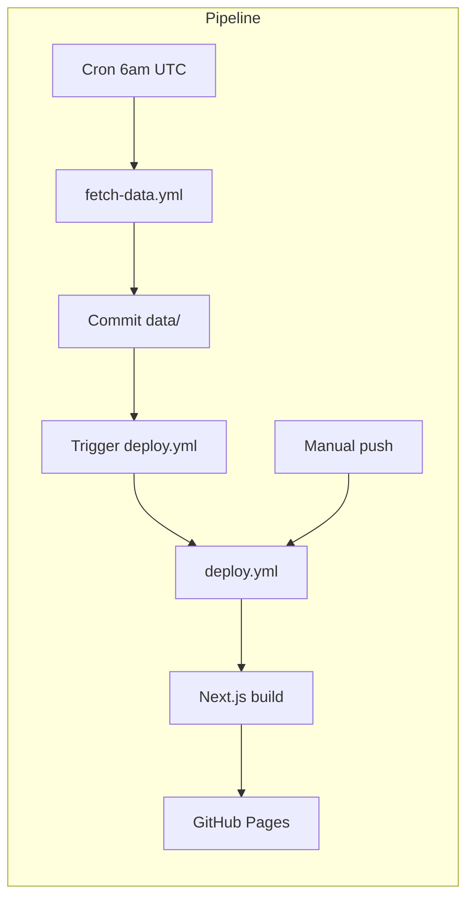

# FPL Stats - Let's Keep Trying Our Best!

A static website tracking Fantasy Premier League mini-league **79657** ("Let's Keep Trying Our Best!"). Built with Next.js, TypeScript, and Tailwind CSS, deployed via GitHub Pages.

## Features

- **League Standings** — Live table with rank, total points, gameweek score, and week-over-week change
- **Weekly Points Tracking** — Charts showing each manager's points trajectory across the season
- **Transfer History** — Track transfers made each gameweek and any points hits taken
- **Chip Usage** — See when managers activated Wildcard, Triple Captain, Bench Boost, or Free Hit

## Tech Stack

- **Frontend**: Next.js (App Router, static export), TypeScript, Tailwind CSS, Recharts
- **Data**: JSON files in `data/`, updated by GitHub Actions
- **Hosting**: GitHub Pages
- **CI/CD**: Two GitHub Actions workflows (see below)

## Deployment Pipeline

Two workflows work together:

| Workflow | Trigger | Purpose |
|----------|---------|---------|
| `fetch-data.yml` | Daily 6am UTC (cron) or manual | Fetches FPL data, commits to repo, triggers deploy |
| `deploy.yml` | Push to `main` or `workflow_dispatch` | Builds static site and deploys to GitHub Pages |



## Getting Started

### 1. GitHub Pages Setup

1. Push this repo to GitHub
2. Go to **Settings** → **Pages**
3. Under **Build and deployment**, set **Source** to **GitHub Actions**
4. The deploy workflow runs on the next push to `main`

### 2. Initial Data Population

The repo ships with empty placeholder data files. To populate them:

1. **Option A**: Run the fetch workflow manually — Actions → **Fetch FPL Data** → **Run workflow**
2. **Option B**: Locally run `npm run fetch-data`, then commit and push the `data/` folder

After data is committed, the deploy workflow will build and publish the site. The daily cron will keep data fresh and trigger redeploys when it changes.

### 3. Local Development

```bash
npm install
npm run fetch-data   # Populate data/ first
npm run dev
```

Open [http://localhost:3000](http://localhost:3000).

## Data

Data is fetched from the [FPL API](https://fantasy.premierleague.com/api/) and stored as:

- `data/bootstrap.json` — Gameweeks, teams
- `data/league.json` — League standings and member list
- `data/managers/{id}.json` — Per-manager gameweek history and chip usage

To fetch manually:

```bash
npm run fetch-data
```

## Build

```bash
npm run build
```

Static output is written to `out/`. The deploy workflow sets `NEXT_PUBLIC_BASE_PATH` to the repository name for correct GitHub Pages routing (e.g. `https://username.github.io/repo-name/`).
